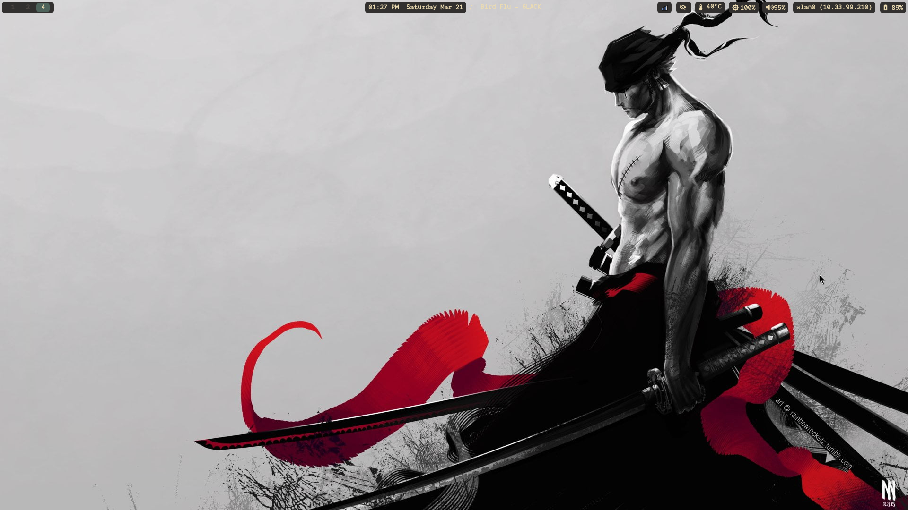
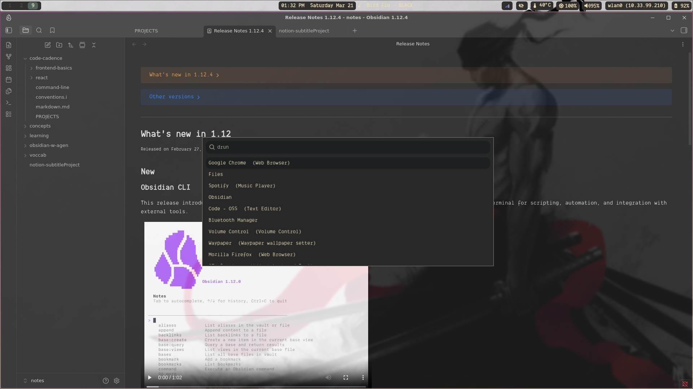
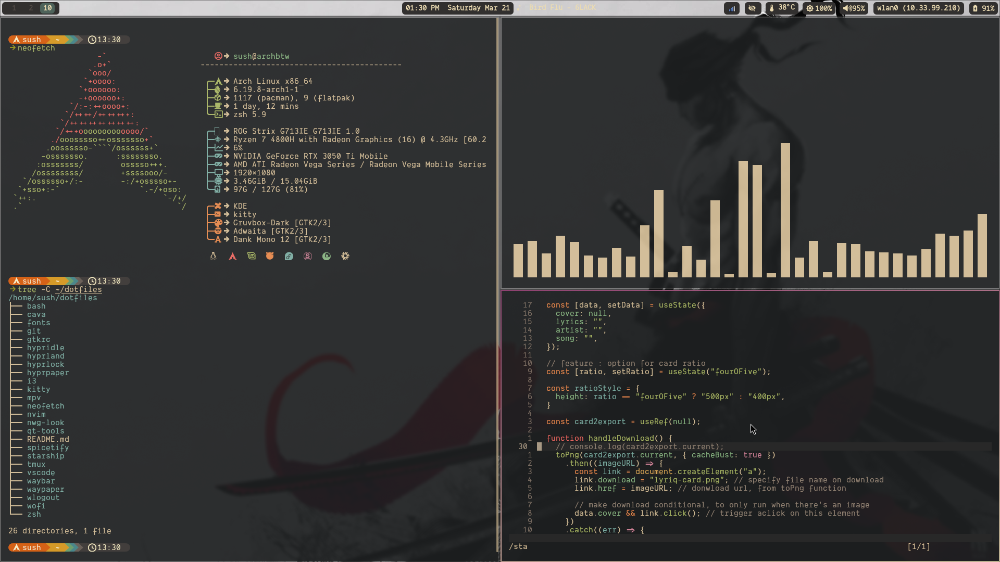

# .files 

Personal Config. for Linux (Arch btw) with hyprland as window manager.

+[ArchInstall (the hard way)](./.stow-local-ignore/ArchInstall.md)
+[Wallpaper Dir](www.github.com/neoayus/.backgrounds)

## Stack

### Window Manager

* Hyprland

#### Core Apps

* wofi — launcher
* waybar — status bar
* nvim — editor
* hyprshot — screenshots
* swaync — notifications
* hyprlock — lock screen
* hypridle — idle manager
* hyprpaper — wallpapers
* starship — shell prompt

#### Shell

* zsh
* zplug

#### Theming

* nwg-look
* lxappearance
* qt5ct

#### Fonts

* Cascadia Code
* nerd fonts

## Keybindings

### System

* `Alt + o` → launcher
* `Alt + c` → close window
* `Alt + Shift + l` → lock screen

### Screenshots

* `Print` → All Windows 
* `Shift + Print` → Specific Window
* `alt + Print` → Full Screen

---

## Screenshots

### Desktop / Waybar

### Wofi

### Terminal Setup

